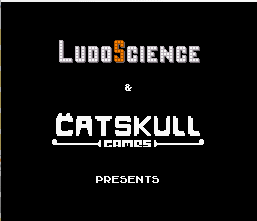
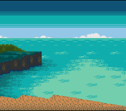
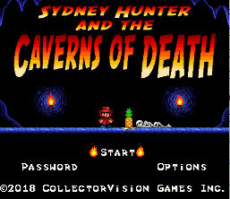

# A library to code in C or ASM for the Nintendo SNES #

**PVSnesLib** (**P**rogrammer **V**aluable **Snes** **Lib**rary) is an open and free library to develop programs for the Nintendo SNES using the C programming language.

Created initially for the 20th birthday of the Nintendo SNES (2012) and based on Ulrich Hecht [SDK](http://code.google.com/p/snes-sdk/), it has been evolved a lot and is now mainly coded in assembler for performances reasons. It is also directly usable in asm for those who do not want to use C language but without rewriting everything from scratch.

It contains a snes-sdk compiler / linker and a library (sources included) which offer facilities to use backgrounds / sprites / pads / music & sound on the Nintendo SNES system.
It also contains examples which demonstrate how to use the functions in the library.

# Before getting started #
First, you need to know that PVSnesLib uses the C language (assembly is possible and highly recommended for some speed aspects). It's highly recommended to be familiar with C programming before trying to develop with PVSnesLib. Learning C language at same time as learning Super Nintendo programming is definitely too difficult and you will end up getting nowhere. It's also important to have a good knowledge of the Super Nintendo hardware.

Here are good entry points to know how Super Nintendo works:

- [**SFC Development Wiki**](https://wiki.superfamicom.org/)
- [**SNESdev Wiki**](https://snes.nesdev.org/wiki/Main_Page/)
- [**Super NES Programming**](https://en.wikibooks.org/wiki/Super_NES_Programming/)

# Current release #

 

To install the library, please download the latest [release](https://github.com/alekmaul/pvsneslib/releases/latest) or with the link below and follow instructions on the [Wiki pages](https://github.com/alekmaul/pvsneslib/wiki).

You can also see the [documentation](https://alekmaul.github.io/pvsneslib/) generated from sources.

# Visual Studio Code #

You can find a Visual Studio Code template in the [vscode-template](https://github.com/alekmaul/pvsneslib/tree/master/vscode-template) folder to help PVSnesLib integration with it.

# Build status #

You can find with the link below the last stable builds of PVSnesLib. They are development builds, you can have bugs not yet resolved with them.

# Dependencies and Docker #

PVSnesLib works on Windows, Linux and MacOS systems.

For people who cannot work with the current builds of PVSneslib, you can build your docker image by following instructions available in the docker folder. Please see [this wiki page](https://github.com/alekmaul/pvsneslib/wiki/Compiling-from-sources) to get all required dependencies.

To use it, you will need at least :

- a unix-like environment like msys2 if you work on Windows

If you want to compile the whole project, please see [this wiki page](https://github.com/alekmaul/pvsneslib/wiki/Compiling-from-sources) to get all required dependencies.

# Contribution #

[GitHub project](https://github.com/alekmaul/pvsneslib)

To discuss about the library, your project or to request help, join us on [Discord](https://discord.gg/DzEFnhB).

PVSneslib and affiliated tools are distributed under the MIT license (see [pvsneslib_license](https://github.com/alekmaul/pvsneslib/blob/master/pvsneslib/pvsneslib_license.txt) file).

# Support PVSneslib #

PVSneslib is free but you can donate to support its development:   

# Powered by PVSneslib #

These projects are based on PVSnesLib _(non-exhaustive list)_:

Yo-Yo Shuriken by [Dr. Ludos](https://drludos.itch.io/yo-yo-shuriken)

Eyra by [Second Dimension](https://www.second-dimension.com/store/eyra-the-crow-maiden-snes)

Sydney Hunter by [CollectorVision](https://collectorvision.com/store/shop/snes/snes-sydney-hunter-the-caverns-of-death-pal/)

# Special thanks #

- [**RetroAntho**](https://github.com/RetroAntho) for his great help to move wla-dx to last version and also for all compilation optimizations in Makefile, snes_rules and, at least, for keeping me motivated to update PVSnesLib 😉.
- [**Kobenairb**](https://github.com/kobenairb/) for the port of python optimiser to c version, docker images, building scripts harmonisation and cleaning and the tcc-816 upgrade.
- [**Digifox**](https://github.com/malayli) and **lunoka** for their work on the intro logo.
- **Ulrich Hecht** for [SNES C SDK](http://code.google.com/p/snes-sdk/).
- **Byuu** for [bass](http://byuu.org/programming/), the assembler with SPC700 support.
- **Mic_** for 816-tcc, [sixpack](http://jiggawatt.org/badc0de/sixpack/), [optimore](http://jiggawatt.org/optimore-816r2.zip) and constify.
- **Neviksti** for pcx2snes.
- [**Shiru**](http://shiru.untergrund.net/) for snesbmp idea & sound tools.
- [**Mukunda**](http://snes.mukunda.com/) for smconv tool.
- **RedBug** for constify tcc bug fix and tips for Linux and Docker.
- [**Mills32**](https://github.com/mills32) for his mode7 3D example.
- [**N_Arno**](https://github.com/nArnoSNES/) for his help on Linux version.

And, of course, all the [**discord community**](https://discord.gg/DzEFnhB) !

Thanks !
