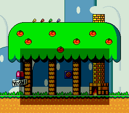

# Transparent HDMA Window on SNES

## Description
This is a demo showing a transparent HDMA Window over the background 2 (BG2) for the Super Famicom and the Super Nintendo.

## Credits
Code made by [Digifox](https://github.com/malayli).

## Preview

## How to build
### Visual Studio Code
- Install Visual Studio Code
- Open the root directory with Visual Studio Code
- Build: Shit+Ctrl+B
- Open logo.sfc with a SNES Emulator
