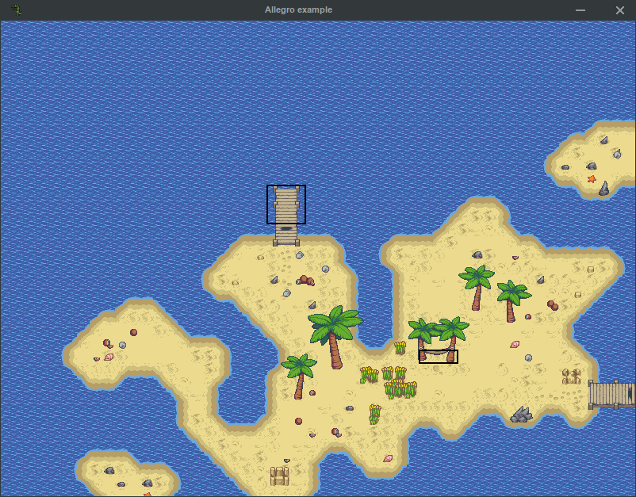

Creating a map renderer from scratch
====================================

In this article, you will learn how to create a Map renderer from scratch using different game programming libraries:
`SDL 2`_, `Allegro 5`_ and `raylib`_. In this article we will assume that you are already proficient with one of these
libraries, have a working version installed or are able to compile it by yourself.

We will be using a map from Tiled's examples: `rpg/island.tmx`_. That particular map features a single :term:`Tileset`
defined in its own :term:`TSX` file, several :term:`Layers <Layer>`, :term:`Objects <Object>` and animated
:term:`Tiles <Tile>`.

.. _SDL 2: https://www.libsdl.org/
.. _Allegro 5: https://liballeg.org/
.. _raylib: https://www.raylib.com/
.. _rpg/island.tmx: https://github.com/bjorn/tiled/tree/master/examples/rpg

Initial set-up
--------------

Unfortunately as in any project we have to start with the usual boilerplate code to initialise libraries, create a
display (window), and the main loop.

.. tabs::

   .. code-tab:: c SDL 2

         #include <stdio.h>
         #include <tmx.h>
         #include <SDL.h>
         #include <SDL_events.h>

         #define DISPLAY_H 600
         #define DISPLAY_W 800

         static SDL_Renderer *ren = NULL;

         Uint32 timer_func(Uint32 interval, void *param) {
           SDL_Event event;
           SDL_UserEvent userevent;

           userevent.type = SDL_USEREVENT;
           userevent.code = 0;
           userevent.data1 = NULL;
           userevent.data2 = NULL;

           event.type = SDL_USEREVENT;
           event.user = userevent;

           SDL_PushEvent(&event);
           return(interval);
         }

         int main(int argc, char **argv) {
           SDL_Window *win;
           SDL_Event ev;
           SDL_TimerID timer_id;

           SDL_SetMainReady();
           if (SDL_Init(SDL_INIT_VIDEO|SDL_INIT_EVENTS|SDL_INIT_TIMER) != 0) {
             fputs(SDL_GetError(), stderr);
             return 1;
           }

           if (!(win = SDL_CreateWindow("SDL2 example", SDL_WINDOWPOS_UNDEFINED, SDL_WINDOWPOS_UNDEFINED, DISPLAY_W, DISPLAY_H, SDL_WINDOW_SHOWN))) {
             fputs(SDL_GetError(), stderr);
             return 1;
           }

           if (!(ren = SDL_CreateRenderer(win, -1, SDL_RENDERER_ACCELERATED | SDL_RENDERER_PRESENTVSYNC))) {
             fputs(SDL_GetError(), stderr);
             return 1;
           }

           SDL_EventState(SDL_MOUSEMOTION, SDL_DISABLE);

           timer_id = SDL_AddTimer(30, timer_func, NULL);

           while (SDL_WaitEvent(&ev)) {

             if (ev.type == SDL_QUIT) break;

             render_map(map); // Function to be implemented
             SDL_RenderPresent(ren);
           }

           SDL_RemoveTimer(timer_id);
           SDL_DestroyRenderer(ren);
           SDL_DestroyWindow(win);
           SDL_Quit();

           return 0;
         }

   .. code-tab:: c Allegro 5

         #include <stdio.h>
         #include <tmx.h>
         #include <allegro5/allegro.h>
         #include <allegro5/allegro_image.h>
         #include <allegro5/allegro.h>

         #define DISPLAY_H 600
         #define DISPLAY_W 800

         int main(int argc, char **argv) {
           ALLEGRO_DISPLAY *display = NULL;
           ALLEGRO_TIMER *timer = NULL;
           ALLEGRO_EVENT_QUEUE *equeue = NULL;
           ALLEGRO_EVENT ev;

           if (!al_init() || !al_init_image_addon() || !al_init_primitives_addon()) {
             fputs("Cannot initialise the Allegro library", stderr);
             return 1;
           }

           display = al_create_display(DISPLAY_W, DISPLAY_H);
           if (!display) {
             fputs("Cannot create a display", stderr);
             return 1;
           }
           al_set_window_title(display, "Allegro example");

           equeue = al_create_event_queue();
           if (!equeue) {
             fputs("Cannot create an event queue", stderr);
             return 1;
           }

           timer = al_create_timer(1.0/30.0);
           if (!timer) {
             fputs("Cannot create a timer", stderr);
             return 1;
           }

           al_register_event_source(equeue, al_get_display_event_source(display));
           al_register_event_source(equeue, al_get_timer_event_source(timer));
           al_start_timer(timer);

           while (al_wait_for_event(equeue, &ev), 1) {

             if (ev.type == ALLEGRO_EVENT_DISPLAY_CLOSE) break;

             render_map(map); // Function to be implemented
             al_flip_display();
           }

           al_destroy_timer(timer);
           al_destroy_event_queue(equeue);
           al_destroy_display(display);

           return 0;
         }

   .. code-tab:: c raylib

         #include <stdlib.h>
         #include <stdio.h>
         #include <tmx.h>
         #include <raylib.h>

         #define DISPLAY_H 600
         #define DISPLAY_W 800

         int main(int argc, char **argv) {
           InitWindow(DISPLAY_W, DISPLAY_H, "raylib example");
           if (!IsWindowReady()) {
             fputs("Cannot create a window", stderr);
             return 1;
           }

           SetTargetFPS(30);

           while (!WindowShouldClose()) {
             BeginDrawing();
             render_map(map); // Function to be implemented
             EndDrawing();
           }

           CloseWindow();

           return 0;
         }

Now we can load the map and check for errors. **libTMX** offers :ref:`several means to load a map <load-functions>`,
we will be using the simple :c:func:`tmx_load` function.

.. code-block:: c

   tmx_map *map = tmx_load(argv[1]);
   if (map == NULL) {
     tmx_perror("Cannot load map");
     return 1;
   }

The :c:func:`tmx_load` function returns a pointer to a :doc:`datastructure <datastructure>` that contains all the map
informations.

Now the map is loaded, except it is not entirely loaded, we need to load all the images referenced by the map.
We could navigate the map :doc:`datastructure <datastructure>`, and for every image we meet, load it. But libTMX offers
an easier way to do that without the hassle: :ref:`callback functions <image-autoload-autofree>`.

| **libTMX** can use two callback functions to delegate the image loading and image freeing to your library/engine.
| One callback to load: :c:data:`tmx_img_load_func`.
| One callback to free: :c:data:`tmx_img_free_func`.
| These callbacks **must be set BEFORE you call any load function**.

.. tabs::

   .. code-tab:: c SDL 2

         void* SDL_tex_loader(const char *path) {
           return IMG_LoadTexture(ren, path);
         }

         /* Set the callback globs in the main function */
         tmx_img_load_func = SDL_tex_loader;
         tmx_img_free_func = (void (*)(void*))SDL_DestroyTexture;

         tmx_map *map = tmx_load(argv[1]);
         /* ... */
         tmx_map_free(map);

   .. code-tab:: c Allegro 5

         void* Allegro5_tex_loader(const char *path) {
           ALLEGRO_BITMAP *res    = NULL;
           ALLEGRO_PATH   *alpath = NULL;

           if (!(alpath = al_create_path(path))) return NULL;

           al_set_new_bitmap_format(ALLEGRO_PIXEL_FORMAT_ANY_WITH_ALPHA);
           res = al_load_bitmap(al_path_cstr(alpath, ALLEGRO_NATIVE_PATH_SEP));

           al_destroy_path(alpath);

           return (void*)res;
         }

         /* Set the callback globs in the main function */
         tmx_img_load_func = Allegro5_tex_loader;
         tmx_img_free_func = (void (*)(void*))al_destroy_bitmap;

         tmx_map *map = tmx_load(argv[1]);
         /* ... */
         tmx_map_free(map);

   .. code-tab:: c raylib

         void* raylib_tex_loader(const char *path) {
           Texture2D *returnValue = malloc(sizeof(Texture2D));
           *returnValue = LoadTexture(path);
           return returnValue;
         }

         void raylib_free_tex(void *ptr)
         {
           UnloadTexture(*((Texture2D*)ptr));
           free(ptr);
         }

         /* Set the callback globs in the main function */
         tmx_img_load_func = raylib_tex_loader;
         tmx_img_free_func = raylib_free_tex;

         tmx_map *map = tmx_load(argv[1]);
         /* ... */
         tmx_map_free(map);

.. note::
   It is better to load the image into a :term:`Texture` that can be drawn directly without overhead.

Rendering
---------

Rendering a map is quite simple, clear the display to the background colour, then draw all the :term:`layers <Layer>`.

.. tabs::

   .. code-tab:: c SDL 2

      void set_color(int color) {
        tmx_col_bytes col = tmx_col_to_bytes(color);
        SDL_SetRenderDrawColor(ren, col.r, col.g, col.b, col.a);
      }

      void render_map(tmx_map *map) {
        set_color(map->backgroundcolor);
        SDL_RenderClear(ren);
        draw_all_layers(map, map->ly_head); // Function to be implemented
      }

   .. code-tab:: c Allegro 5

      ALLEGRO_COLOR int_to_al_color(int color) {
        tmx_col_floats res = tmx_col_to_floats(color);
        return *((ALLEGRO_COLOR*)&res);
      }

      void render_map(tmx_map *map) {
        al_clear_to_color(int_to_al_color(map->backgroundcolor));
        draw_all_layers(map, map->ly_head); // Function to be implemented
      }

   .. code-tab:: c raylib

      Color int_to_color(int color) {
        tmx_col_bytes res = tmx_col_to_bytes(color);
        return *((Color*)&res);
      }

      void render_map(tmx_map *map) {
        ClearBackground(int_to_color(map->backgroundcolor));
        draw_all_layers(map, map->ly_head); // Function to be implemented
      }

In the datastructure, all the :term:`layers <Layer>` are stored in a :term:`Linked List` ordered from background
to foreground, to make it easier to draw these layers in the correct order:

.. code-block:: c

   void draw_all_layers(tmx_map *map, tmx_layer *layers) {
     while (layers) {
       if (layers->visible) {

         if (layers->type == L_GROUP) {
           draw_all_layers(map, layers->content.group_head); // recursive call
         }
         else if (layers->type == L_OBJGR) {
           draw_objects(layers->content.objgr); // Function to be implemented
         }
         else if (layers->type == L_IMAGE) {
           draw_image_layer(layers->content.image); // Function to be implemented
         }
         else if (layers->type == L_LAYER) {
           draw_layer(map, layers); // Function to be implemented
         }
       }
       layers = layers->next;
     }
   }

Image Layers
^^^^^^^^^^^^

This is a simplistic implementation, as it lacks support for the offsetting and the opacity properties to be complete.

.. tabs::

   .. code-tab:: c SDL 2

      void draw_image_layer(tmx_image *image) {
        SDL_Rect dim;
        dim.x = dim.y = 0;

        SDL_Texture *texture = (SDL_Texture*)image->resource_image; // Texture loaded by libTMX
        SDL_QueryTexture(texture, NULL, NULL, &(dim.w), &(dim.h));
        SDL_RenderCopy(ren, texture, NULL, &dim);
      }

   .. code-tab:: c Allegro 5

      void draw_image_layer(tmx_image *image) {
        ALLEGRO_BITMAP *bitmap = (ALLEGRO_BITMAP*)image->resource_image;
        al_draw_bitmap(bitmap, 0, 0, 0);
      }

   .. code-tab:: c raylib

      void draw_image_layer(tmx_image *image) {
        Texture2D *texture = (Texture2D*)image->resource_image;
        DrawTexture(*texture, 0, 0, WHITE);
      }

Tile layers
^^^^^^^^^^^

.. code-block:: c

   void draw_layer(tmx_map *map, tmx_layer *layer) {
     unsigned long i, j;
     unsigned int gid, x, y, w, h, flags;
     float op;
     tmx_tileset *ts;
     tmx_image *im;
     void* image;
     op = layer->opacity;
     for (i=0; i<map->height; i++) {
       for (j=0; j<map->width; j++) {
         gid = (layer->content.gids[(i*map->width)+j]) & TMX_FLIP_BITS_REMOVAL;
         if (map->tiles[gid] != NULL) {
           ts = map->tiles[gid]->tileset;
           im = map->tiles[gid]->image;
           x  = map->tiles[gid]->ul_x;
           y  = map->tiles[gid]->ul_y;
           w  = ts->tile_width;
           h  = ts->tile_height;
           if (im) {
             image = im->resource_image;
           }
           else {
             image = ts->image->resource_image;
           }
           flags = (layer->content.gids[(i*map->width)+j]) & ~TMX_FLIP_BITS_REMOVAL;
           draw_tile(image, x, y, w, h, j*ts->tile_width, i*ts->tile_height, op, flags); // Function to be implemented
         }
       }
     }
   }

.. tabs::

   .. code-tab:: c SDL 2

      void draw_tile(void *image, unsigned int sx, unsigned int sy, unsigned int sw, unsigned int sh,
                     unsigned int dx, unsigned int dy, float opacity, unsigned int flags) {
        SDL_Rect src_rect, dest_rect;
        src_rect.x = sx;
        src_rect.y = sy;
        src_rect.w = dest_rect.w = sw;
        src_rect.h = dest_rect.h = sh;
        dest_rect.x = dx;
        dest_rect.y = dy;
        SDL_RenderCopy(ren, (SDL_Texture*)image, &src_rect, &dest_rect);
      }

   .. code-tab:: c Allegro 5

      void draw_tile(void *image, unsigned int sx, unsigned int sy, unsigned int sw, unsigned int sh,
                     unsigned int dx, unsigned int dy, float opacity, unsigned int flags) {
        ALLEGRO_COLOR colour = al_map_rgba_f(opacity, opacity, opacity, opacity);
        al_draw_tinted_bitmap_region((ALLEGRO_BITMAP*)image, colour, sx, sy, sw, sh, dx, dy, flags);
      }

   .. code-tab:: c raylib

      void draw_tile(void *image, unsigned int sx, unsigned int sy, unsigned int sw, unsigned int sh,
                     unsigned int dx, unsigned int dy, float opacity, unsigned int flags) {
        DrawTextureRec((Texture2D*)image, (Rectangle) {sx, sy, sw, sh}, (Vector2) {dx, dy}, (Color) {opacity, opacity, opacity, opacity});
      }

Object layers
^^^^^^^^^^^^^

In this section we will take advantage of the shape drawing functions provided by the library we are using, therefore we
are limited by the availability of draw functions for each kind of shape.

.. tabs::

   .. code-tab:: c SDL 2

      void draw_polyline(double **points, double x, double y, int pointsc) {
        int i;
        for (i=1; i<pointsc; i++) {
          SDL_RenderDrawLine(ren, x+points[i-1][0], y+points[i-1][1], x+points[i][0], y+points[i][1]);
        }
      }

      void draw_polygon(double **points, double x, double y, int pointsc) {
        draw_polyline(points, x, y, pointsc);
        if (pointsc > 2) {
          SDL_RenderDrawLine(ren, x+points[0][0], y+points[0][1], x+points[pointsc-1][0], y+points[pointsc-1][1]);
        }
      }

      void draw_objects(tmx_object_group *objgr) {
        SDL_Rect rect;
        set_color(objgr->color);
        tmx_object *head = objgr->head;
        while (head) {
          if (head->visible) {
            if (head->obj_type == OT_SQUARE) {
              rect.x =     head->x;  rect.y =      head->y;
              rect.w = head->width;  rect.h = head->height;
              SDL_RenderDrawRect(ren, &rect);
            }
            else if (head->obj_type  == OT_POLYGON) {
              draw_polygon(head->content.shape->points, head->x, head->y, head->content.shape->points_len);
            }
            else if (head->obj_type == OT_POLYLINE) {
              draw_polyline(head->content.shape->points, head->x, head->y, head->content.shape->points_len);
            }
            else if (head->obj_type == OT_ELLIPSE) {
              /* FIXME: no function in SDL2 */
            }
          }
          head = head->next;
        }
      }

   .. code-tab:: c Allegro 5

      #define LINE_THICKNESS 2.5

      void draw_polyline(double **points, double x, double y, int pointsc, ALLEGRO_COLOR color) {
        int i;
        for (i=1; i<pointsc; i++) {
          al_draw_line(x+points[i-1][0], y+points[i-1][1], x+points[i][0], y+points[i][1], color, LINE_THICKNESS);
        }
      }

      void draw_polygone(double **points, double x, double y, int pointsc, ALLEGRO_COLOR color) {
        draw_polyline(points, x, y, pointsc, color);
        if (pointsc > 2) {
          al_draw_line(x+points[0][0], y+points[0][1], x+points[pointsc-1][0], y+points[pointsc-1][1], color, LINE_THICKNESS);
        }
      }

      void draw_objects(tmx_object_group *objgr) {
        ALLEGRO_COLOR color = int_to_al_color(objgr->color);
        tmx_object *head = objgr->head;
        while (head) {
          if (head->visible) {
            if (head->obj_type == OT_SQUARE) {
              al_draw_rectangle(head->x, head->y, head->x+head->width, head->y+head->height, color, LINE_THICKNESS);
            }
            else if (head->obj_type  == OT_POLYGON) {
              draw_polygone(head->content.shape->points, head->x, head->y, head->content.shape->points_len, color);
            }
            else if (head->obj_type == OT_POLYLINE) {
              draw_polyline(head->content.shape->points, head->x, head->y, head->content.shape->points_len, color);
            }
            else if (head->obj_type == OT_ELLIPSE) {
              al_draw_ellipse(head->x + head->width/2.0, head->y + head->height/2.0, head->width/2.0, head->height/2.0, color, LINE_THICKNESS);
            }
          }
          head = head->next;
        }
      }

   .. code-tab:: c raylib

      #define LINE_THICKNESS 2.5

      void draw_polyline(double offset_x, double offset_y, double **points, int points_count, Color color) {
        int i;
        for (i=1; i<points_count; i++) {
          DrawLineEx((Vector2){offset_x + points[i-1][0], offset_y + points[i-1][1]},
                     (Vector2){offset_x + points[i][0], offset_y + points[i][1]},
                     LINE_THICKNESS, color);
        }
      }

      void draw_polygon(double offset_x, double offset_y, double **points, int points_count, Color color) {
        draw_polyline(offset_x, offset_y, points, points_count, color);
        if (points_count > 2) {
          DrawLineEx((Vector2){offset_x + points[0][0], offset_y + points[0][1]},
                     (Vector2){offset_x + points[points_count-1][0], offset_y + points[points_count-1][1]},
                     LINE_THICKNESS, color);
        }
      }

      void draw_objects(tmx_object_group *objgr) {
        tmx_object *head = objgr->head;
        Color color = int_to_color(objgr->color);

        while (head) {
          if (head->visible) {
            if (head->obj_type == OT_SQUARE) {
              DrawRectangleLinesEx((Rectangle){head->x, head->y, head->width, head->height}, LINE_THICKNESS, color);
            }
            else if (head->obj_type  == OT_POLYGON) {
              draw_polygon(head->x, head->y, head->content.shape->points, head->content.shape->points_len, color);
            }
            else if (head->obj_type == OT_POLYLINE) {
              draw_polyline(head->x, head->y, head->content.shape->points, head->content.shape->points_len, color);
            }
            else if (head->obj_type == OT_ELLIPSE) {
              DrawEllipseLines(head->x + head->width/2.0, head->y + head->height/2.0, head->width/2.0, head->height/2.0, color);
            }
          }
          head = head->next;
        }
      }

Usage
-----

For each game libraries, the final source file and a cmake build script can be fetched from libTMX's `example folder`_.
Build and invoke the example to display the map.

.. _example folder: https://github.com/baylej/tmx/tree/master/examples/

.. tabs::

   .. code-tab:: bash SDL 2

      cd sdl
      mkdir build ; cd build
      cmake ..
      make
      ./sdl_example path/to/tiled/examples/rpg/island.tmx

   .. code-tab:: bash Allegro 5

      cd allegro
      mkdir build ; cd build
      cmake ..
      make
      ./al5_example path/to/tiled/examples/rpg/island.tmx

   .. code-tab:: bash raylib

      cd raylib
      mkdir build ; cd build
      cmake ..
      make
      ./raylib_example path/to/tiled/examples/rpg/island.tmx

The expected output:

What next?
----------

The renderer we implemented is quite simplistic, also it redraws the map at each iteration, and lacks a few features.
Here are a few things you could do next:

* Render the map onto a texture to greatly reduce the number of draw calls
* Implement scrolling
* Support animated tiles
* ...
